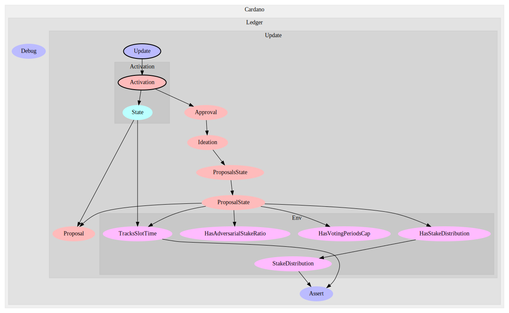
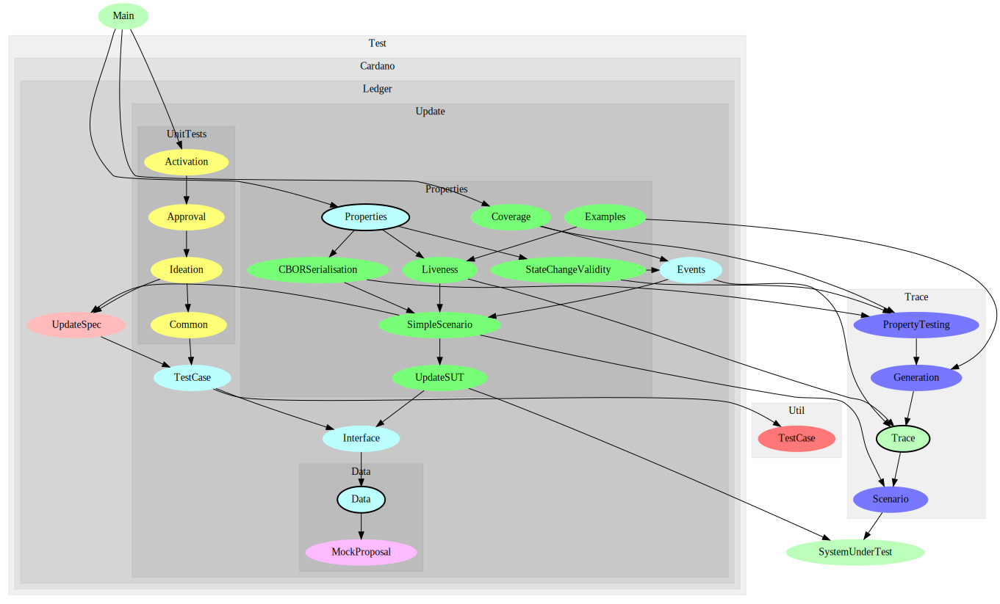

This directory contains an implementation of the decentralized system updates
mechanism for stake-based blockchains described in the [design
specification](../design-spec). This implementation was materialized as a
Haskell library that was designed to be plugged in the [ledger
layer](https://github.com/input-output-hk/cardano-ledger-specs) of Cardano.

Module `Cardano.Ledger.Update` contains the API that the ledger can use. This
API is divided into state update and state query functions.

State update functions take as parameters a combination (of some) of the
following values:

- an environment,
- an update payload, and
- an update system state.

The state update functions are `initialState`, `tick`, and `apply`.

The API is polymorphic on the type of environments. The `*.Env.*` namespace
contains the classes that model restrictions that the update module imposes on
the environment instances.

Similarly, the API does not constrain the proposals to a specific type, but it
defines a `Proposal` class which provides a generic model for proposals.
Module `Cardano.Ledger.Update.Proposal` contains the definition of this
class. Its instances define what:

- submissions,
- revelations,
- vote, and
- voters

are. Moreover, we abstracted away:

- signatures,
- commits, and
- hashes.

These abstractions can be found in the `Cardano.Ledger.Update.Proposal` module.
More specifically:

- the `Signed` class abstracts away data whose signature can be verified. In
  practice, verifying signatures on the data submitted in a transaction is
  responsibility of the ledger layer that uses this API, so this class and its
  usages should be removed.
- The `Commitable` class introduces the concept of data for which a commit can
  be calculated. This makes it possible to make use of the commit-reveal
  protocol when submitting proposals.
- The `Identifiable` class introduces the concept of data for which an unique id
  can be calculated. In practice, the calculation of such an id will realized by
  means of a `hash` function. In the tests of this library, this calculation was
  realized by unsigned integers instead, which made the execution of the
  property tests considerably faster.

Some proposals take the form of protocol updates, and can therefore be
activated. Class `Activable` in `Cardano.Ledger.Update.Proposal` models the
concept of protocol updates that can be activated. In particular, instances of
this class define the endorsers and protocol version types.

State query functions allow to retrieve information about update proposals and
current protocol without breaking the encapsulation of the update API.

# Plugging delegation

The stake distribution that some API functions require is provided as a
parameter, inside the environment. This makes the delegation to experts an
orthogonal concern: the update protocol does not care how the stake distribution
is elaborated. This would be the responsibility of a component that deals with
delegation to experts. In this way, the current implementation allows for its
use in combination with a delegation mechanism.

## Module structure

The module structure of the implementation is shown below.



As mentioned previously, the update mechanism API entry point is in
`Cardano.Ledger.Update`. This modules relies on the `Activation`, `Approval`,
and `Ideation` modules. In particular, `Activation` relies on `Approval` to get
information about approved proposals that can enter the activation phase.
Similarly, `Approval` relies on the `Ideation` module to get information about
approved SIP proposals.

The `Approval` and `Ideation` modules both rely on the `ProposalsState` module,
which contains functions to keep track of the state of the different update
proposals submitted to the system.

Environment constraints are modeled by the:
- `TracksSlotTime`,
- `HasAdversarialStakeRatio`,
- `HasVotingPeriodsCap`, and
- `HasStakeDistribution`
classes. See the corresponding files for more details.

# Tests

The implementation of the update mechanism contains an extensive series of unit
and property tests. We use
[`QuickCheck`](https://hackage.haskell.org/package/QuickCheck) as our property
based testing library, and this document assumes familiarity with property-based
testing.

The module structure of the testing code is show below, and
explained next.



The unit tests are located under the `Test.Cardano.Ledger.Update.UnitTests`
namespace. We have unit tests for each of the phases of a system update. The
tests are written in a simple embedded domain-specific language (eDSL) that
models actions that change the update state and assertions on said state. For
example, the test that checks that a certain SIP is approved can be expressed as
follows:

```haskell
  update <- mkUpdate (SpecId 1) (mkParticipant 0) (`increaseVersion` 1)
  submit `sip` update
  tickTillStable
  reveal `sip` update
  tickTillStable
  approve `sip` update
  tickFor $ Proposal.votingPeriodDuration (getSIP update)
  tickTillStable
  tickTillStable
  stateOf update `shouldBe` SIP (IsStably Approved)
```

These unit tests provide simple ways of checking that the implementation behaves
as expected, but more importantly, they provide a way to document the behavior
of the system in a way that can be executed and checked. For instance, the test
`implVotesAreNotCarriedOver`, in module
`Test.Cardano.Ledger.Update.UnitTests.Approval`, describes the expected behavior
of the system when a proposal undergoes two voting periods. In particular, this
test expresses the fact that the votes of a proposal are not carried over to the
next period.

The property tests rely on the notion of traces. The update system API consists
of _state transforming functions_ of the form:

```haskell
:: ( ... ) => st -> d -> Either err st
```

This is: given some initial state and some data (in particular a slot or some
update payload, like a vote), return either an error if the function could not
be applied, or the result of applying the data the initial state. Thus, the
behavior of the system's API can be modeled in terms state evolution. Here the
state evolves by applying _actions_, which in our context can be slot ticks or
the application of a certain update payload. Traces are modeled in module
`Trace`. A trace has two type parameters `s` and `t`:

```haskell
data Trace s t = ...
```

Here `s` represents the type of the system under test. It is the system under
test what defines the types of the actions and states of the trace. Systems
under tests are modeled by the `SUT` class, defined in module `SystemUnderTest`.
The type `t` represents the type of _scenario_ that accompanies the trace. Below
we provide an explanation of the concept of scenario.

We provide an example of a trace below:

```haskell
Initial state:
--------------------------------------------------------------------------------
[ Unknown ]
Events:
--------------------------------------------------------------------------------
[
          ( UpdateAct
              ( Ideation
                  ( Submit
                      ( MockSubmission
                          { mpSubmissionCommit = MockCommit 1
                          , mpSubmissionSignatureVerifies = True
                          }
                      )
                  )
              )
          , [ SIP Submitted ]
          )
      ,
          ( TickAct
          , [ SIP Submitted ]
          )
      ,
          ( TickAct
          , [ SIP StablySubmitted ]
          )
      ,
          ( UpdateAct
              ( Ideation
                  ( Reveal
                      ( MockRevelation
                          { refersTo = MockCommit 1
                          , reveals = MockProposal
                              { mpId = MPId 1
                              , mpVotingPeriodDuration = SlotNo 0
                              , mpPayload = ()
                              }
                          }
                      )
                  )
              )
          , [ SIP Revealed ]
          )
      ,
          ( TickAct
          , [ SIP Revealed ]
          )
      ,
          ( TickAct
          , [ SIP StablyRevealed ]
          )
      ,
          ( TickAct
          , [ SIP StablyRevealed ]
          )
      ,
          ( TickAct
          ,
              [ SIP ( Is Expired ) ]
          )
      ]
```

The trace above corresponds to an execution of the update system in which a
proposal is submitted it expires. The state are abstracted away, and only the
state of the update proposal is shown in the trace. To get examples of classes
of update-mechanism traces see module `Test.Cardano.Ledger.Update.Properties`.

We test the update-mechanism properties by expressing properties on traces. To
test them, we need to generate these traces. In our framework, a trace is
_uniquely determined_ by its `Scenario`:

```haskell
elaborateTrace :: forall s t . HasScenario s t => Scenario t -> Trace s t
```

A `Scenario` contains all the information necessary to reconstruct a trace. For
instance, in the context of the update mechanism, a scenario might contain:

- The network stability parameter.
- The update proposals.
- The initial stake distribution of voters an endorsers.
- The sequence of update actions to be executed.

Once it is possible to generate random scenarios, we can elaborate scenarios
into traces, and therefore property-test properties on traces. More specifically,
this can be achieved via the module `Trace.PropertyTesting` function:

```haskell
forAllTracesShow
  :: forall s t prop
   . ( Arbitrary (Scenario t)
     , HasScenario s t
     , Testable prop
     )
  => (Trace s t -> prop) -> (Trace s t -> String) -> Property
```

See module `Trace.Scenario` for details on the `HasScenario` typeclass.

The `HasScenario` instance we used for the property tests of the update
mechanism can be found in module
`Test.Cardano.Ledger.Update.Properties.SimpleScenario`. A noteworthy feature of
the scenario generator defined in that module (and therefore of the trace
generation process) is that the action generators are quite trivial to write and
they incorporate _no update mechanism logic_. Not only this reduces the effort
required to write and maintain the generators, but also decouples them from the
implementation.

[This file](./about-the-testing-framework.org) contains the outline of a
presentation given in an internal IOG seminar. For more details contact [Damian
Nadales](mailto:damian.nadales@iohk.io).

## Which properties are tested

We have tests for the following types of properties:

- liveness
- safety
- coverage

### Liveness properties

Liveness properties check that certain classes of traces are accepted for the
update mechanism. For instance, the update mechanism should allow:

- an SIP to be approved
- an implementation to be approved
- an approved implementation to be activated
- an SIP to be rejected
- an implementation to be rejected
- an approved implementation not to be activated and be marked as expired
- etc

Given a class of traces (like the ones exemplified above), our tests use
`QuickCheck` to (ramdomly) search for traces that fall into that class. If
`QuickCheck` finds such a trace, it will return a minimal version of that trace
so that it can be inspected. Of course, this "counterexample" does not
constitute a failure.

Given a class of traces, if we fail to see examples of traces in this class this
might point to an error in the generators or a failure in the implementation.
In any case these liveness tests make sure that such cases are detected so that
corrective action can be taken.

In addition, by inspecting the examples generated by `QuickCheck` we can get a
better insight into the system's behavior. For instance, when inspecting a trace
that showed that an implementation of an SIP could be approved, we found out
that the system allowed an implementation commit to be submitted even before its
corresponding SIP was approved. Depending on the requirements, this might be an
acceptable behavior or not.

### Safety properties

The safety properties we wrote define what are the allowed:

- states of an update proposals
- transitions between those states
- conditions when transitioning from one state to another

All the properties are aggregated into a single property, called
`prop_updateEventTransitionsAreValid` and defined in module
`Test.Cardano.Ledger.Update.Properties.StateChangeValidity`. Given an
update-system trace, this property multiplex the trace into event traces per
each update proposal present in the trace. Here an _update event_ refers to the
change in the state of an update proposal (e.g., when it goes from "stably
submitted" to rejected). The notion of update event is defined in module
`Test.Cardano.Ledger.Update.Events`.

The function `validateTransition` in
`Test.Cardano.Ledger.Update.Properties.StateChangeValidity` provides an encoding
of an event transition table that determines the valid event transitions
(relative to an update proposal), and what which conditions should hold in that
transition.

### Coverage tests

The thoughtfulness of our property tests depend on generating cases for the
major scenarios (both valid and invalid). For instance, we would like to test
traces in which a proposal gets revealed before its corresponding commit is
stable on the chain. Or cases in which a proposal is voted outside its voting
period. To make sure these cases are generated, we have coverage tests in module
`Test.Cardano.Ledger.Update.Properties.Coverage`.

# Bechmarks

We ran benchmarks to measure the CPU and memory consumed by the tally process.
This is the part of the protocol that requires the biggest amount of resources,
therefore the importance of having a good insight into its implementation
performance.

The benchmarks can be found in the
[bench/micro-benchmarking](./bench-microbenchmarking) directory. The
benchmarking results are presented in the [design
specification](../design-spec).

# Worst case analysis

Next to the benchmarks, we have calculations on the impact the system has on a
blockchain throughput, which we measure using transaction-bytes-per-second. In
[bench/worst-case-analysis](./bench/worst-case-analysis) there is a program that
carries out the impact calculation for different type of parameters like number
of participants, number of proposals, and voting period duration. This program
outputs the results as a LaTeX tables and plots. These results were incorporated
in the [design specification](../design-spec).
